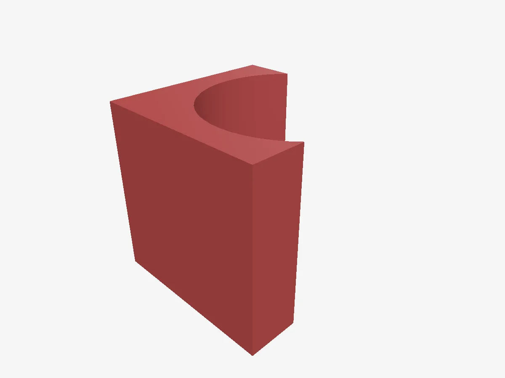

# Sculpo

A browser-based solid modeller for 3D printing. Drag primitives onto a
workplane, mark them solid or hole, group them to cut one from another, and
export STL. Tinkercad-shaped, self-hosted, and yours.



*A box and a cylinder, grouped — the cylinder marked as a hole. Rendered by
Sculpo's own preview camera.*

**Every bit of geometry runs in your browser.** The server — which is optional
— stores the scene graph as JSON and never touches a mesh. That is what lets
the whole thing run on a NAS, and it means the tool keeps working with the
network unplugged.

## What it does

**Model.** Sixteen primitives — box, cylinder, sphere, hemisphere, cone,
torus, tube, wedge, roof, pyramid, polygon, octagon, star, gear, thread, and
3D text — placed by click, snapped against neighbours as you go. Move, rotate
and scale by gizmo or by typing exact numbers.

**Cut.** Any shape can be a *hole* instead of a solid. Group it with a solid
and the boolean runs — subtract a cylinder to drill, a box to notch. Groups
nest, so the result is just another shape you can cut with.

**Sketch.** Scribble a closed outline freehand and extrude it to a solid, or
revolve it around an axis for turned parts.

**Import.** STL, OBJ and SVG. Dense scans get decimated on the way in
(quadric simplification via meshoptimizer) so a 700k-triangle download stays
editable.

**Measure.** A ruler that snaps to corners and midpoints, a datum you can drop
anywhere for live offsets, alignment across any axis, mirroring, and a build
plate outline for your printer's actual footprint.

**Export.** Binary STL or OBJ, whole scene or selection.

**Find.** A library of your saved designs as a grid of cards, each showing a
rendered preview of the model rather than a filename. Previews are drawn by
the browser, isometric and framed to the design.

**Anywhere.** Installable PWA that works offline. Point it at a server and
projects sync across devices on their own — there is no save button. There is
also a native iPad app wrapping the same build. Desktop and touch are both
first-class: the interface follows whichever input you last used, so an iPad
with a mouse attached gets whichever it is being held by.

## Try it

```bash
npm install --prefix pwa && npm run dev --prefix pwa
```

That is the whole tool. No server, no account — projects live in your browser
until you give it somewhere to sync to.

## Self-hosting

The server exists only to sync projects between devices. It is a FastAPI app
over Postgres holding scene-graph JSON, with username/password accounts.

```bash
docker compose up
```

Web on `:8120`, API on `:8020`, Postgres on `:5436`.

For a real deployment, `docker-compose.portainer.yml` is the image-only stack:
CI publishes `ghcr.io/<owner>/sculpo-{api,web}`, the host pulls, and every
secret is supplied as an environment variable. It ships a nightly `pg_dump`
sidecar and expects to sit behind a reverse proxy.

| Variable | Required | Notes |
| --- | --- | --- |
| `SECRET_KEY` | yes | 32+ chars. Refuses to start on a placeholder. |
| `ADMIN_USERS` | yes | Comma-separated admin usernames. |
| `ADMIN_SIGNUP_SECRET` | strongly advised | Must be presented to register an admin name. Without it, on a reachable instance whoever registers that name first owns the instance. |
| `DB_PASSWORD` | yes | Postgres password. |
| `APP_PORT` | no | Host port, default 8220. |
| `IMAGE_TAG` | no | Defaults to `latest`. Set to a `sha-<commit>` tag to pin a known-good api/web pair. |

Accounts are closed by default. Admins register themselves; everyone else
needs an invite, which an admin creates in the UI and which produces a
single-use code to pass on. The username alone is not enough to register —
usernames are guessable, codes are not. Codes are stored hashed, shown once,
and expire after 14 days (`INVITE_TTL_DAYS`).

Passwords are bcrypt-hashed, session tokens are stored hashed, and every
project query is scoped to its owner. Failed logins are throttled per
username-and-address, so a stranger guessing at your name cannot lock you out.

### Backups

A sidecar takes a nightly `pg_dump` into `/volume1/docker/sculpo/backups` and
keeps fourteen days. That is the same disk as the database, so it protects
against a bad migration, not a dead NAS. For an off-site copy, start the stack
with `COMPOSE_PROFILES=offsite`, set `RCLONE_REMOTE` to any rclone target, and
put a matching `rclone.conf` in `/volume1/docker/sculpo/rclone/`.

## Architecture

- **`pwa/`** — Vite + React + TypeScript, three.js via @react-three/fiber,
  CSG through three-bvh-csg, state in zustand with undo via zundo.
- **`backend/`** — FastAPI, async SQLAlchemy, Alembic migrations run from the
  container entrypoint.
- **`infra/nginx/`** — static serving, security headers, per-IP rate limiting
  on the auth endpoints.

Units are millimetres and the world is Z-up, so the workplane is XY. Undo
snapshots the scene graph on discrete actions, never per gizmo frame.

## Development

```bash
npm run dev --prefix pwa          # frontend, proxies /api to :8020
```

```bash
cd backend && cp .env.example .env && alembic upgrade head
uvicorn app.main:app --port 8020
```

```bash
cd backend && pytest              # in-memory sqlite, no services needed
npm run lint --prefix pwa         # oxlint
```

CI runs the backend tests, a typecheck, the linter and a production build, and
only publishes container images if all of them pass.

## Security

Please report vulnerabilities privately — see [SECURITY.md](SECURITY.md).
Regression tests for previously-found issues live in
`backend/tests/test_security_regressions.py`; each one pins a hole that was
open so it cannot quietly reopen.

## License

[GNU AGPL-3.0](LICENSE). Self-host it, modify it, sell it — but if you run a
modified version as a service other people use, those people are entitled to
your changes.
